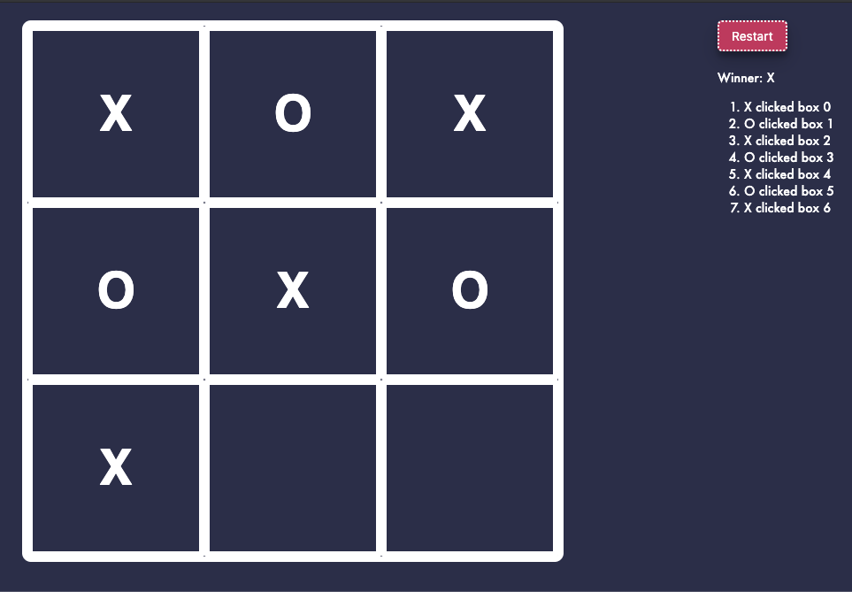

<p align="center">
  
</p>

# Tic Tac Toe

Simple Tic Tac Toe game. All actions are synced in the server. Restart will create a new session.

## Setup & start services (Without docker):

1.  Install npm packages(on both repo):

```bash
npm i
```

2. Setup environment variables:

- Copy `.env.example` to `.env` and replace `.env` configurations with yours(backend).
- Configure `src/config.json` in the frontend.

4. Start server(on both repo)
```bash
npm run start
```

Running the above commands results in 
* **API Server** running at `http://localhost:4000`
* **Frontend Server** is at `http://localhost:3000`

6. Run tests (backend)
```bash
npm run test
```

## Setup & start services (With docker):

1. Setup environment variables:

Copy `.env.example` to `.env` and replace `.env` configurations with yours.

2. Run with docker
```bash
docker-compose up
```
